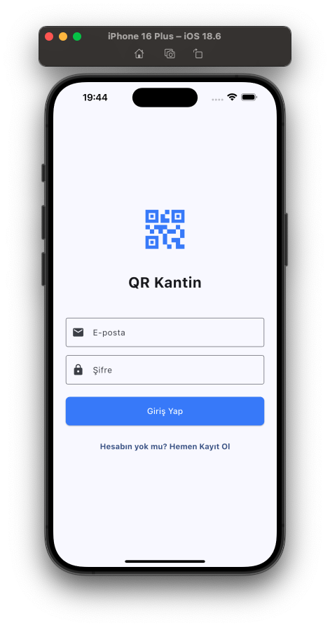
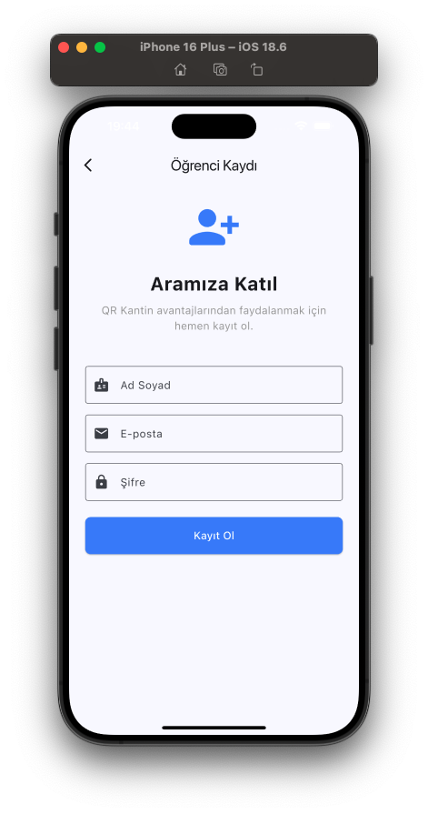
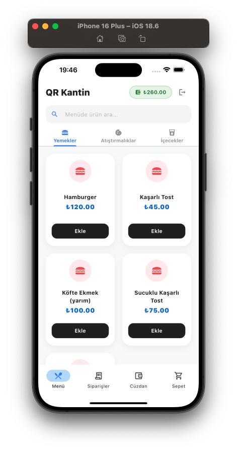
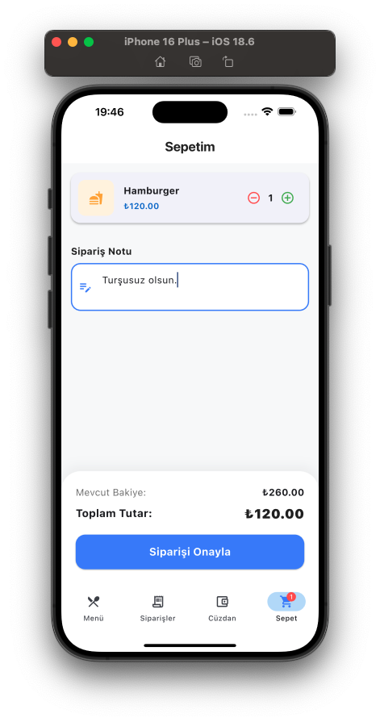
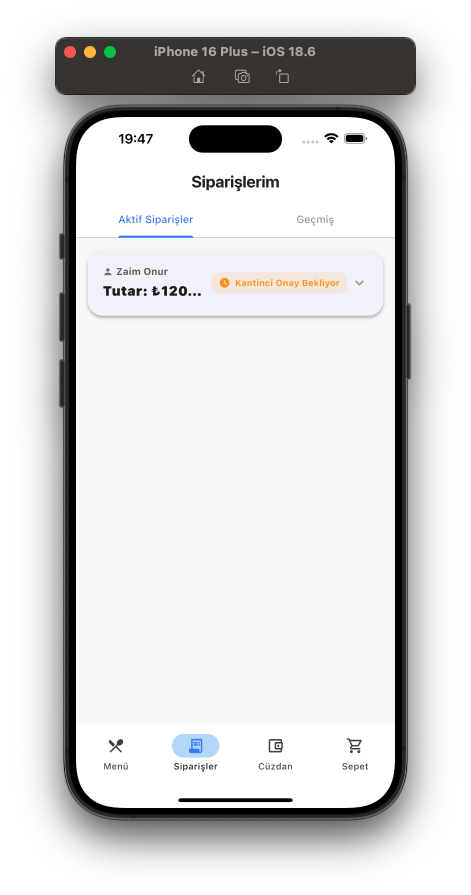
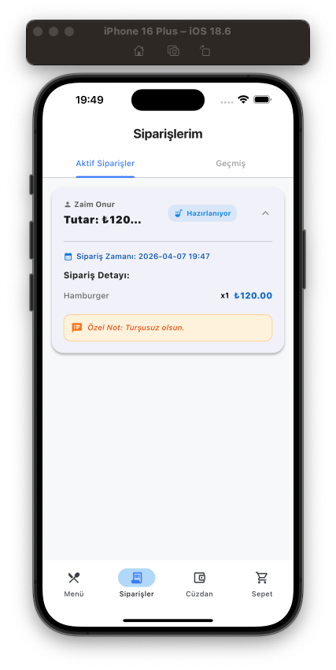
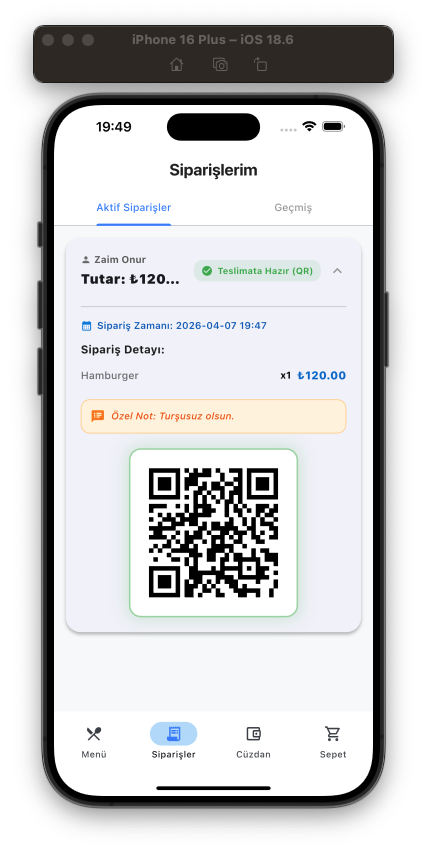
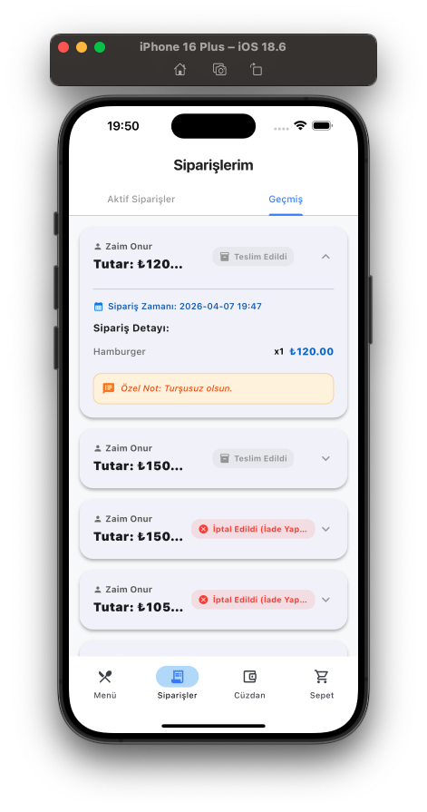
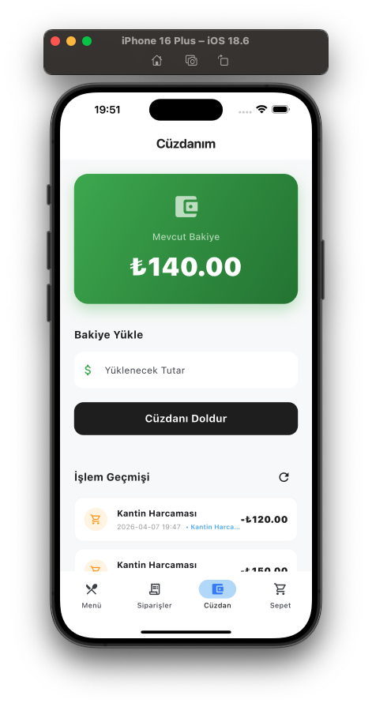

# QR Kantin - Mobil Uygulama

## 🧩 Ana Ekranlar

### 🔐 Kimlik Doğrulama & 🍔 Menü & 🛒 Sepet

<table>
  <tr>
    <td>
      
    </td>
    <td>
      
    </td>
    <td>
      
    </td>
    <td>
      
    </td>
  </tr>
  <tr>
    <td align="center"><b>Giriş Ekranı</b></td>
    <td align="center"><b>Kayıt Ekranı</b></td>
    <td align="center"><b>Menü Ekranı</b></td>
    <td align="center"><b>Sepet Ekranı</b></td>
  </tr>
</table>

### 📦 Sipariş Takibi & ⏱️ Geçmiş

<table>
  <tr>
    <td>
      
    </td>
    <td>
      
    </td>
    <td>
      
    </td>
    <td>
      
    </td>
  </tr>
  <tr>
    <td align="center"><b>Onay Bekliyor</b></td>
    <td align="center"><b>Onaylandı</b></td>
    <td align="center"><b>Sipariş Hazır</b></td>
    <td align="center"><b>Geçmiş Siparişler</b></td>
  </tr>
</table>

### 💳 Cüzdan Yönetimi

<table>
  <tr>
    <td>
      
    </td>
  </tr>
  <tr>
    <td align="center"><b>Cüzdan Ekranı</b></td>
  </tr>
</table>

Bu proje, **QR Kantin** sisteminin kullanıcı (öğrenci/öğretmen) tarafındaki mobil uygulamasıdır. Flutter SDK kullanılarak geliştirilen uygulama; hızlı sipariş, dijital cüzdan yönetimi ve canlı sipariş takibi gibi özellikleri modern bir arayüzle sunar.

## 🚀 Öne Çıkan Özellikler

* **QR Kod ile Hızlı Sipariş:** Menüden seçilen ürünlerin QR kod entegrasyonu ile saniyeler içinde sipariş edilmesi.
* **Canlı Sipariş Takibi:** WebSocket bağlantısı üzerinden sipariş durumunun (Hazırlanıyor, Hazır, Teslim Edildi) anlık olarak izlenmesi.
* **Dijital Cüzdan & Bakiye:** Kullanıcı bakiyesinin takibi, harcama geçmişi ve güvenli bakiye yönetim arayüzü.
* **Reaktif State Management:** Riverpod kütüphanesi ile uygulama genelinde tutarlı ve performanslı veri yönetimi.
* **Modern Navigasyon:** GoRouter ile yönetilen, derin bağlantı (deep linking) destekli ve güvenli rota yapısı.

## 🛠️ Teknoloji Yığını ve Mimari

* **Framework:** Flutter
* **State Management:** Riverpod
* **Navigation:** GoRouter
* **Networking:** Dio (Interceptor & JWT Auth desteği ile)
* **Real-time:** WebSockets (Canlı veri senkronizasyonu)
* **Mimari:** Feature-first Clean Architecture (Özellik bazlı temiz mimari yapısı)

## 📦 Kurulum ve Başlatma

Projeyi yerel cihazınızda çalıştırmak için aşağıdaki adımları izleyin:

1. **Bağımlılıkları Yükleyin:**
   `flutter pub get`

2. **Kod Üretimini Çalıştırın (Gerekiyorsa):**
   `flutter pub run build_runner build --delete-conflicting-outputs`

3. **Uygulamayı Başlatın:**
   `flutter run`

## 📜 Lisans ve Telif Hakkı

Bu yazılımın tüm telif hakları **Onur Zaim**'e aittir.

* Eğitim ve kişisel inceleme amaçlı kullanım serbesttir.
* Yazılı izin alınmaksızın herhangi bir ticari projede kullanılması, kopyalanması veya satılması yasaktır.
* Ticari lisans ve iş birliği talepleri için **zaimonur08@gmail.com** adresi üzerinden iletişime geçebilirsiniz.

---
© 2026 Onur Zaim. Tüm Hakları Saklıdır.
